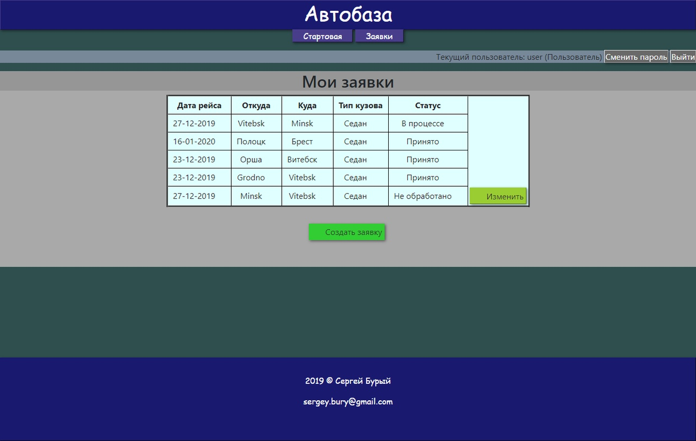
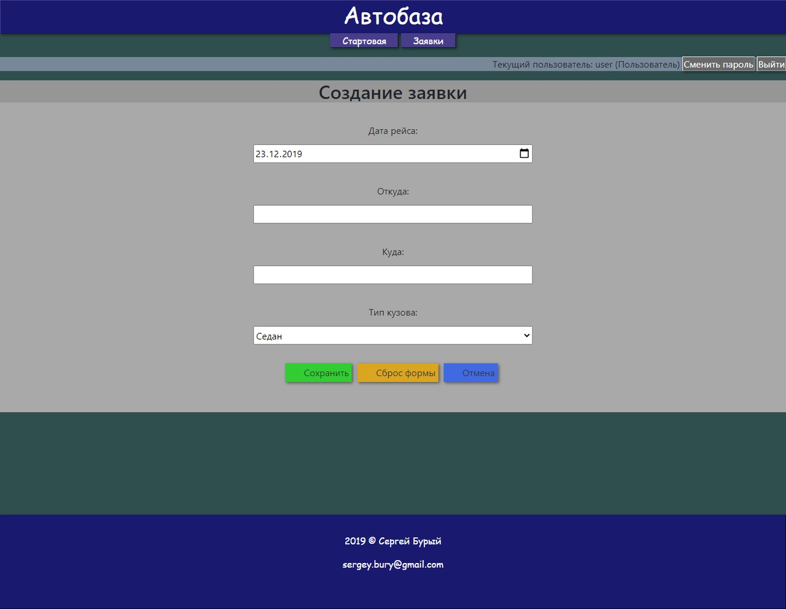
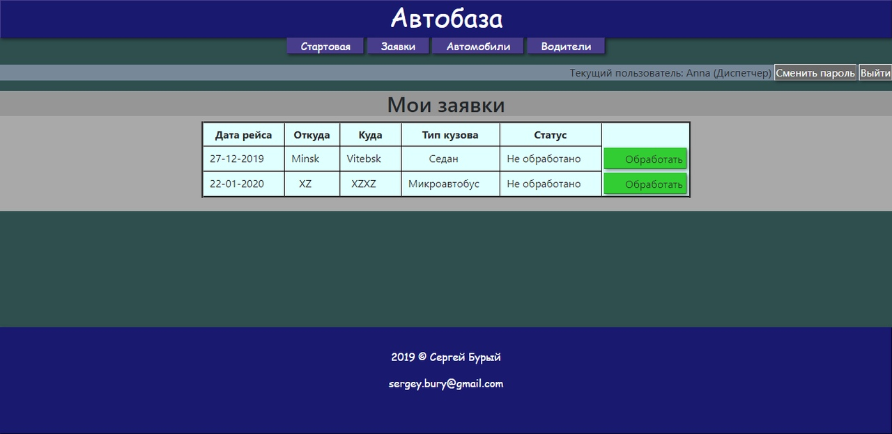
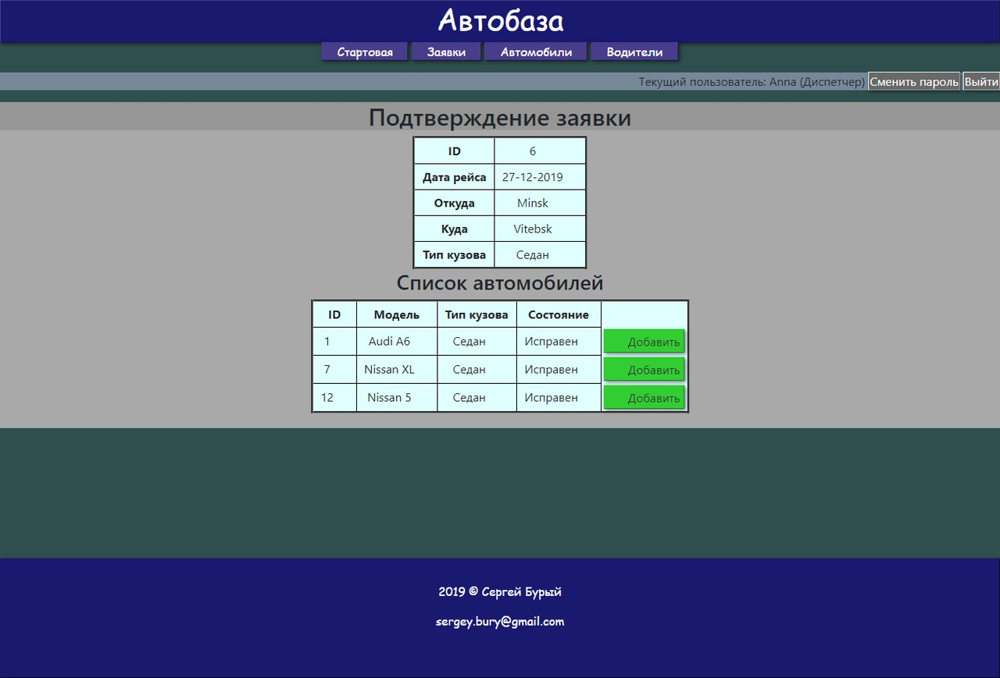

# Motor Depot
Разработать подсистему для работы с базой данных предложенной предметной области.

Система Автобаза. Диспетчер распределяет Заявки на Рейсы между Водителями, за каждым из которых закреплен свой Автомобиль. 
На Рейс может быть назначен Автомобиль, находящийся в исправном состоянии и характеристики которого соответствуют Заявке. 
Водитель делает отметку о выполнении Рейса и состоянии Автомобиля.

### Пользователь

### Диспетчер

